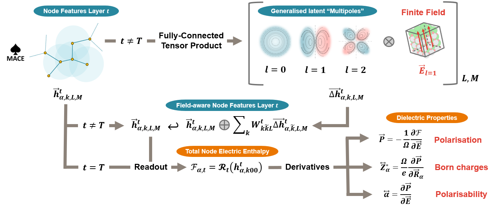

<p align="center">
  
</p>


# MACE-Field: Electric-Field–Aware MACE Models

**MACE-Field** extends the [MACE](https://github.com/ACEsuit/mace) architecture to learn **electric-field–dependent energy functionals** for molecules and periodic materials. From a *single scalar electric enthalpy*, MACE-Field exposes **dielectric response observables** via **automatic differentiation**, ensuring derivative consistency by construction.

> **Status**  
> This repository tracks development of MACE-Field while it is being upstreamed into MACE:  
> https://github.com/ACEsuit/mace/pull/1177

---

## What you get

Given an electric enthalpy $E(\mathbf{R}, \mathbf{E})$ (or $H(\mathbf{R}, \mathbf{E})$ depending on convention), MACE-Field can produce:

- **Polarization**  
  $\mathbf{P} = -\frac{1}{\Omega}\,\frac{\partial E}{\partial \mathbf{E}}$

- **Born effective charges (BECs)**  
  $Z^\ast_{\kappa,\alpha\beta} = \frac{\partial P_\alpha}{\partial R_{\kappa,\beta}}$

- **Polarizability/susceptibility**  
  $\chi_{\alpha\beta} = \frac{\partial P_\alpha}{\partial E_\beta}$

All quantities are **derivative-consistent** (Maxwell relations, acoustic sum rule, etc.) because they come from differentiating the same scalar.

MACE-Field supports:
- training **from scratch**, and
- **fine-tuning** existing MACE foundation models to become field-aware.

---

## Installation

```bash
git clone https://github.com/mdi-group/mace-field.git
pip install ./mace
```

---

## Architecture summary



MACE-Field preserves the standard MACE backbone and readout, but **injects a uniform electric field** (an $O(3)$ irrep `1o`) into the latent equivariant features at each interaction layer.

Conceptually:
1. Local atomic neighbourhoods are expanded into equivariant features (as in MACE/ACE).
2. A **global electric field** couples to these features through symmetry-allowed tensor products.
3. The model still outputs a **scalar energy** (electric enthalpy).
4. Dielectric observables are obtained by **exact differentiation** of this scalar.

At **zero field**, MACE-Field reduces to standard MACE, allowing for the reuse of foundation weights.

---

## Data format

MACE-Field uses ASE-readable datasets (typically **extended XYZ / extxyz**).

### Required configuration-level fields (`atoms.info`)

| Key | Shape | Units |
|---|---:|---|
| `REF_energy` | scalar | eV |
| `REF_stress` or `REF_virials` | (6,) or (3,3) | eV/ų (stress) or eV (virials) |
| `REF_electric_field` | (3,) | V/Å |
| `REF_polarization` | (3,) | e/Ų |
| `REF_polarizability` | (3,3) or (9,) | e/(V·Å) |

### Required per-atom arrays (`atoms.arrays`)

| Key | Shape | Units |
|---|---:|---|
| `REF_forces` | (N,3) | eV/Å |
| `REF_becs` | (N,3,3) | e |

> Key names can be overridden via CLI/config flags.

---

## Training a MACE-Field model

Training uses the standard MACE CLI with:
- `--model MACEField`
- `--loss universal_field`

```bash
python -m mace.scripts.run_train \
  --model MACEField \
  --name MACEField_model \
  --train_file data/field_train.xyz \
  --valid_fraction 0.2 \
  --device cuda \
  --r_max 5.0 \
  --num_interactions 2 \
  --num_channels 128 \
  --max_L 1 \
  --loss universal_field \
  --energy_weight 1.0 \
  --forces_weight 100.0 \
  --polarization_weight 1.0 \
  --becs_weight 100.0 \
  --polarizability_weight 100.0
```

### Polarization branch folding (periodic systems)

Polarization is multi-valued under lattice translations. During training, MACE-Field compares **folded polarization differences**, which:
- avoids branch discontinuities,
- supports ferroelectric switching paths,
- preserves conservative/derivative definitions.

---

## Fine-tuning a MACE foundation model (field-aware)

One of MACE-Field’s key strengths is **foundation-model inheritance**. You can fine-tune a pretrained MACE model (e.g. `mace-mp-0b3`) to add polarization/BEC/polarisability behaviour with minimal loss of energy/force accuracy.

### Multi-head fine-tuning example

```yaml
name: mace-field-mp-0b3-mh
foundation_model: mace-mp-0b3-medium.model
model: MACEField
loss: universal_field
multiheads_finetuning: true

heads:
  mp-dielectric:
    train_file: becs-polarizabilities-train.xyz
    valid_file: becs-polarizabilities-valid.xyz
  mp-polarization:
    train_file: polarizations-train.xyz
    valid_file: polarizations-valid.xyz

pt_train_file: mp_replay.xyz
compute_forces: true
compute_polarization: true
compute_becs: true
compute_polarizability: true
```

Run:

```bash
torchrun --standalone --nproc_per_node=gpu \
  python -m mace.scripts.run_train --config config.yaml
```

---

## Inference

### ASE calculator

```python
from mace.calculators import MACECalculator

calc = MACECalculator(
    model_path="MACEField.model",
    model_type="MACEField",
    electric_field=[0.0, 0.0, 0.02],  # overrides per-structure field
    device="cuda",
)

atoms.calc = calc
E = atoms.get_potential_energy()
P = atoms.calc.results["polarization"]       # (3,)
Z = atoms.calc.results["becs"]               # (N,3,3)
alpha = atoms.calc.results["polarizability"] # (3,3)
```

### Batch inference over XYZ

```bash
mace_eval_configs \
  --configs input.xyz \
  --model MACEField.model \
  --output output.xyz \
  --compute_polarization \
  --compute_becs \
  --compute_polarizability
```

---

## Finite-field molecular dynamics (ASE)

```python
atoms.info["REF_electric_field"] = [0.0, 0.0, 0.1]

# If you want a time-dependent field:
calc.electric_field = [0.0, 0.0, Ez_t]
```

This enables workflows such as:
- ferroelectric hysteresis loops,
- finite-temperature dielectric response,
- IR / Raman response driven by field/strain protocols.

---

## LAMMPS + MACE-Field (MLIAP)

MACE-Field can be used in **LAMMPS** via the **MLIAP** interface (including Kokkos GPU builds). The simplest and most robust way to supply a uniform field is via an environment variable read by the MLIAP Python wrapper.

### LAMMPS: constant electric field

Example (Kokkos GPU, single GPU):

```bash
export MACE_EFIELD_MODE=env \
export MACE_EFIELD=0,0,0.3 \
lmp -k on g 1 -sf kk -pk kokkos gpu/aware on neigh half newton on -in in.lammps_macefield
```

This feeds $\mathbf{E} = (0, 0, 0.3)$ V/Å to MACE-Field at every MD step.

### LAMMPS: time-dependent electric field (MACE-Field via env var)

MACE-Field’s LAMMPS ML-IAP wrapper can take a **time-dependent** electric field by updating the environment variable `MACE_EFIELD` **every MD step** from LAMMPS equal-style variables.

This approach keeps the wrapper simple: it only needs to **re-read `os.environ["MACE_EFIELD"]` each step**.

#### 1) Define the field as LAMMPS equal-style variables

Define `Ex`, `Ey`, `Ez` in your `in.lammps` (here `Ez` is sinusoidal in `step`):

```lammps
variable        E0     equal 0.30
variable        period equal 2000

variable        Ex equal 0.0
variable        Ey equal 0.0
variable        Ez equal v_E0*sin(2.0*PI*step/v_period)
```

#### 2) Push `Ex,Ey,Ez` into `MACE_EFIELD` every step via `python/invoke`

This Python snippet runs inside LAMMPS, reads the current values using `extract_variable`, and updates `MACE_EFIELD`:

```lammps
python set_mace_efield here """
import os
from lammps import lammps

def set_mace_efield(lammps_ptr):
    lmp = lammps(ptr=lammps_ptr)
    ex = float(lmp.extract_variable("Ex", None, 0))
    ey = float(lmp.extract_variable("Ey", None, 0))
    ez = float(lmp.extract_variable("Ez", None, 0))
    os.environ["MACE_EFIELD"] = f"{ex},{ey},{ez}"
"""
fix mace_efield all python/invoke 1 end_of_step set_mace_efield
```

**What this does:**
- LAMMPS evaluates `Ex/Ey/Ez` for the **current** `step`.
- The Python hook converts them to floats and sets `MACE_EFIELD="ex,ey,ez"`.
- The MACE-Field LAMMPS wrapper reads `MACE_EFIELD` on the next force call and feeds it to the model.

---

## References

If you use this code, please cite:

```bibtex
@misc{martin2025generallearningelectricresponse,
  title={General Learning of the Electric Response of Inorganic Materials},
  author={Martin, Bradley A. A. and Ganose, Alex M. and Kapil, Venkat and Li, Tingwei and Butler, Keith T.},
  year={2025},
  eprint={2508.17870},
  archivePrefix={arXiv},
  primaryClass={cond-mat.mtrl-sci}
}
```

and the main MACE papers:

```bibtex
@inproceedings{Batatia2022mace,
  title={{MACE}: Higher Order Equivariant Message Passing Neural Networks for Fast and Accurate Force Fields},
  author={Batatia, Ilyes and Kovacs, David Peter and Simm, Gregor N. C. and Ortner, Christoph and Csanyi, Gabor},
  booktitle={Advances in Neural Information Processing Systems},
  year={2022}
}

@misc{Batatia2022Design,
  title = {The Design Space of E(3)-Equivariant Atom-Centered Interatomic Potentials},
  author = {Batatia, Ilyes and Batzner, Simon and Kov{'a}cs, D{'a}vid P{'e}ter and Musaelian, Albert and Simm, Gregor N. C. and Drautz, Ralf and Ortner, Christoph and Kozinsky, Boris and Cs{'a}nyi, G{'a}bor},
  year = {2022},
  eprint = {2205.06643},
  archiveprefix = {arXiv}
}
```

# Acknowledgments
This work has been supported by UKRI funding (EP/Y000552/1 and EP/Y014405/1).

---

## Contact

- **MACE-Field**: bradley.martin@ucl.ac.uk  
- **MACE core**: ilyes.batatia@ens-paris-saclay.fr  
- Issues & feature requests: https://github.com/mdi-group/mace-field/issues

