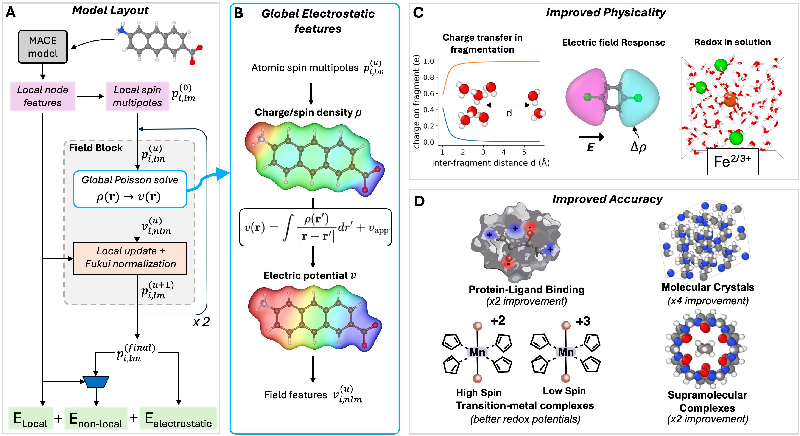

.. _polar_mace:

===================
Electrostatic MACE
===================

PolarMACE is the electrostatic, spin-aware MACE variant for the Polar checkpoints (``1L``, ``2L``, ``3L``).

   Overview of the PolarMACE model layout, global electrostatic features, improved physicality, and improved accuracy across benchmark tasks.

Architecture Summary
--------------------

PolarMACE keeps the local MACE backbone for short-range chemistry and adds a
non-self-consistent long-range update on spin-resolved atomic multipoles. Each
update builds non-local electrostatic features from a smooth multipolar density,
predicts local multipole corrections, then applies global Fukui equilibration to
enforce total charge and spin. The final energy is the sum of local, explicit
electrostatic, and learned non-local terms.

Installation
------------

Install MACE and the electrostatics dependency:

.. code-block:: bash

    pip install mace-torch
    pip install git+https://github.com/WillBaldwin0/graph_electrostatics.git

``graph_electrostatics`` provides the Python module namespace ``graph_longrange``, which PolarMACE requires at runtime.

Available Checkpoints
---------------------

- ``mace-polar-spin-1L.model``
- ``mace-polar-spin-2L.model``
- ``mace-polar-spin-3L.model``

Basic Inference
---------------

.. code-block:: python

    from mace.calculators import MACECalculator

    calc = MACECalculator(
        model_paths="mace-polar-spin-2L.model",
        model_type="PolarMACE",
        device="cpu",           # or "cuda"
        default_dtype="float64" # use float32 for faster MD
    )

    atoms.info["charge"] = 0
    atoms.info["spin"] = 1
    atoms.info["external_field"] = [0.0, 0.0, 0.0]
    atoms.calc = calc

    energy = atoms.get_potential_energy()
    forces = atoms.get_forces()
    stress = atoms.get_stress()

Reading Dipole and Charge Density
----------------------------------

.. code-block:: python

    # populate calc.results
    _ = atoms.get_potential_energy()

    # total molecular dipole vector
    mu = calc.results["dipole"]

    # full atom-centered multipole coefficients
    rho = calc.results["density_coefficients"]

    # spin-up / spin-down multipole coefficients
    rho_spin = calc.results["spin_charge_density"]

    # atom-resolved monopole charges only
    q = calc.results["charges"]

Tensor shapes:

- ``dipole``: ``(3,)``
- ``charges``: ``(n_atoms,)``
- ``density_coefficients``: ``(n_atoms, density_dim)``
- ``spin_charge_density``: ``(n_atoms, 2, density_dim)``
- ``density_dim = (atomic_multipoles_max_l + 1)^2``

For ``atomic_multipoles_max_l=0``, ``density_dim=1`` (monopoles only).
For ``atomic_multipoles_max_l=1``, ``density_dim=4`` (monopole + dipole channels).

Fine-tuning from Polar Foundation Checkpoints
----------------------------------------------

Use ``--foundation_model="mace-polar-2L"`` or ``--foundation_model="mace-polar-3L"``
with ``--model="PolarMACE"`` in ``mace_run_train``.

.. code-block:: bash

    mace_run_train \
      --name="polar_ft_2L" \
      --model="PolarMACE" \
      --foundation_model="mace-polar-2L" \
      --train_file="train.xyz" \
      --valid_fraction=0.05 \
      --energy_key="REF_energy" \
      --forces_key="REF_forces" \
      --stress_key="REF_stress" \
      --loss="weighted" \
      --stress_weight=0.0 \
      --force_mh_ft_lr=True \
      --default_dtype="float64" \
      --device="cpu"
