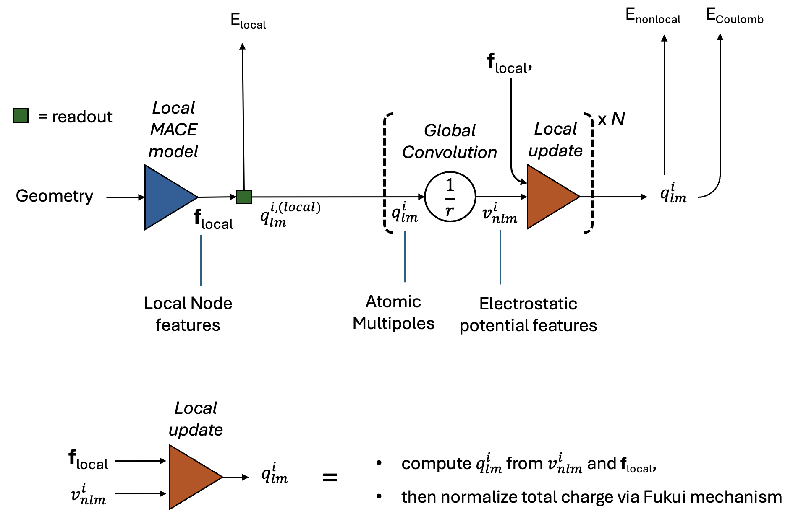

# Basic structure

The archtiecture is still adapting, but a rough overview of the current electrostatic OMOL models is:



A few points about the model:
- This model is not 'self-consistent', since there is no conevrgence criterion. The number of SC-like steps ($N$) is normally just set to 3.
- One can apply external fields, since the electric potential features $v_{nlm}^i$ are proejctions of the actual electric potential, from both the model's charges and from aplied fields. 

# Requirements

- graph_longrange. Contact `WillBaldwin0` and use the `develop` branch. 

# How to use the model

set up and use a calculator via

```python
from mace.calculators import MACECalculator

model_path = "/Users/will/PhDwork/scf/code/omol_models/mace-fukui-spin-3L-xL-25-cpu-trans.model"
calc = MACECalculator(
    model_path,
    device='cpu',
    dtype='float64',
)

atoms.calc = calc
atoms.get_forces()

# with specified total charge, spin, field:
atoms.info['charge'] = 1.0              # (e)
atoms.info['spin'] = 1                  # multiplicity, default=1 (not total spin)
atoms.info['external_field'] = 0.01     # V/\AA. note that sign is REVERSED. fields point uphill, consistent with fhi-aims, vasp, ...
atoms.get_forces()
```

To change the keys for charge, spin, external fields, use:
```
calc = MACECalculator(
    model_path,
    device='cuda',
    info_keys={
        'total_charge': 'custom_charge_key',
        'external_field': 'other_field_key',
        'total_spin': 'my_spin_key',
    }
)
```
In this case, any keys which are not specified will take the default values of `charge`, `spin`, `external_field`. 


# What does the model output

- Energy/forces (as usual)
- Total dipole `results['dipole']`. this is only a well defined quantity for non-periodic systems, and is a meaningless value for periodic systems.
- Partial charges and partial dipoles. These are the final values of $q_{lm}^i$ in the figure above. We store atomic multipoles as spherical (not cartesian) multipoles, and use the Condon-Shortley Phase convention. This can be accessed via `results['density_coefficients]` which is `(n_atoms, 4)`. Partial charges and dipoles can be extracted as 
    - `results['density_coefficients][:,0]`
    - `results['density_coefficients][:,[3,1,2]]`
    Partial charges and dipoles are **not well defined**. Futhermore, sums of thes quantities onto clusters or molecules are also not defined, except one sums the totals on **isolated** fragments, where isolated means that the fragment to be summed doesnt come within ~6\AA of any other atoms
- Partial spins (some models). We also store a spin density array `results['spin_charge_density]` which is `(n_atoms, 2, 4)`. This also contains atomic multipoles, resoved to two different spin channels. The sum across the second index is the atomic multipoes above.

# Models and Naming

### Models trained on partial charges (not recommended)
- 

### Models without spin density channels
- 

### Models with spin density channels
- fukui-large-spin: `mace-fukui-spin-3L-xL-25-cpu-trans.model`
